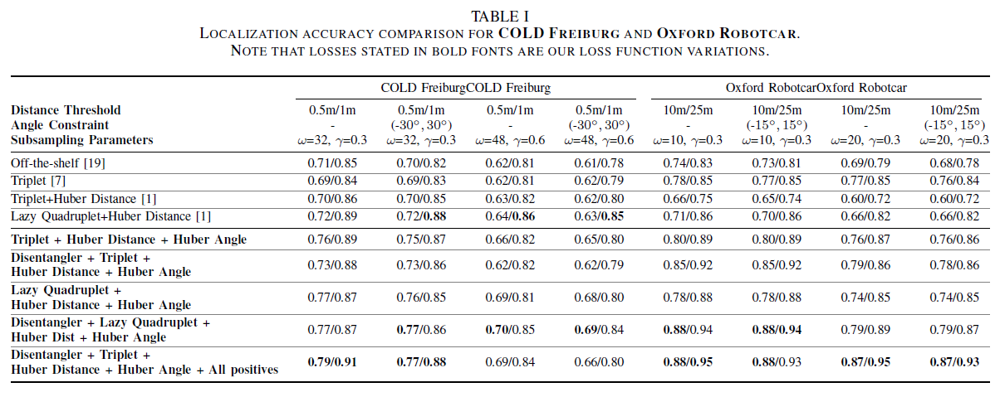
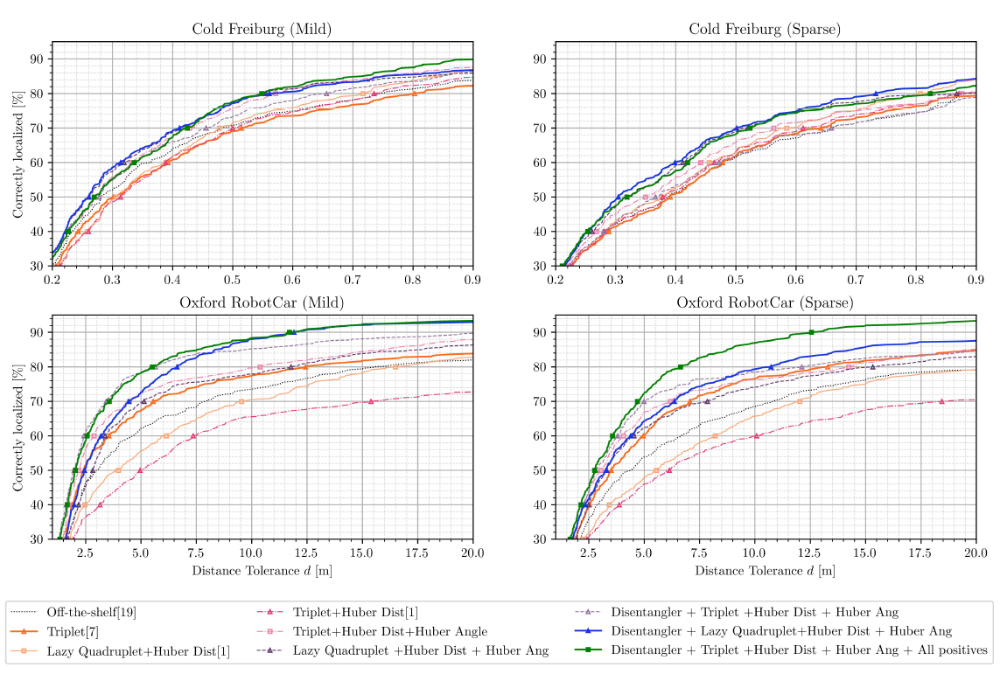
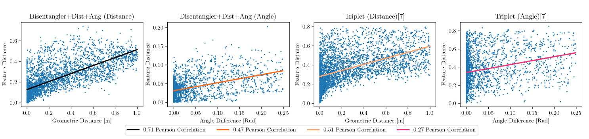

# Distance and Orientation Disentangled Image Features for Retrieval-based Localization
This repository contains my master project conducted in Computer Vision Lab (CVL) at ETH Zürich.

*Abstract*—Accurate localization is an essential task of mobile agents, such as autonomous cars or flying drones, for navigating through an environment and performing various functions. Localization by image retrieval is a promising vision-based solution due to its robustness and efficiency. Retrieval-based localization matches any query image of the environment to a set of reference images with known geographic information. The matching is usually based on a image feature embedding which is learned such that geometrically nearby images are also nearby in the feature space. In this paper, we propose a method for learning an image feature embedding which is capable of predicting both the geometric distance and the relative angle between the query and the retrieved image, while also improving the retrieval accuracy. Being able to predict distance and angle based on the distance between image features, allows to accurately calculate the location of a given query image. Our embedding is learned using a CNN that maps an image into a corresponding feature which consists of two disentangled parts. These two parts are separately responsible for distance and orientation aspects. Furthermore, we also propose a new loss formulation that exploits all available positive examples for higher retrieval accuracy. The experimental results on two benchmark datasets demonstrate the superiority of our method over the state-of-the-art.

You may check our [complete paper](project_report.pdf). Below is the demonstration of the performance of our algorithm vs groundtruth, NetVlad and Lazy Quadruplet on RobotCar Oxford Dataset.

### Respiratory Structure
- `checkpoints`: A directory containing vd16_pitts30k_conv5_3_vlad_preL2_intra_white checkpoint trained on 30,000 images from Pittsburgh 30k dataset.
- `cold_pickles`: A directory contains train_ref, test_ref_s, train_query and test_query_s pickles files to generate latent vectors.
- `datasets`: A directory containing Oxford RobotCar and COLD Freiburg datasets.
- `figures`: The plots and result table.
- `util`: A directory containing utility Python snippets such as model, layers, loss functions.
- `create_cold_queries.py`: A Python snippet to generate pickle files.
- `get_cold_latent_vectors.py`:A Python snippet to generate max_dist, max_f_angle and max_actual_angle latent vectors.
- `train.py`: Model training code.

### Results
Below is the table demonstrating localization accuries w.r.t sampling parameters and loss functions.

    

Localization accuracy as function of distance tolerance indicated below.

    

Pearson‘s correlation values w.r.t angle difference and geometric distance against feature distance. First two plots, from the left, illustrate the outcome
of our model (Disentangler Network with Angle Loss), where as latter two are the outcomes of the Base NetVLAD network.

    

### Acknowledgments
This project is a collaborative work among Mesut Ceylan and Abhinav Aggarwal, and supervised by Dr. Danda Paudel and Dr. Janine Thoma.

### License
This work is licensed under MIT License, however it is subject to repository-owner approval and permission for public and private usage.
